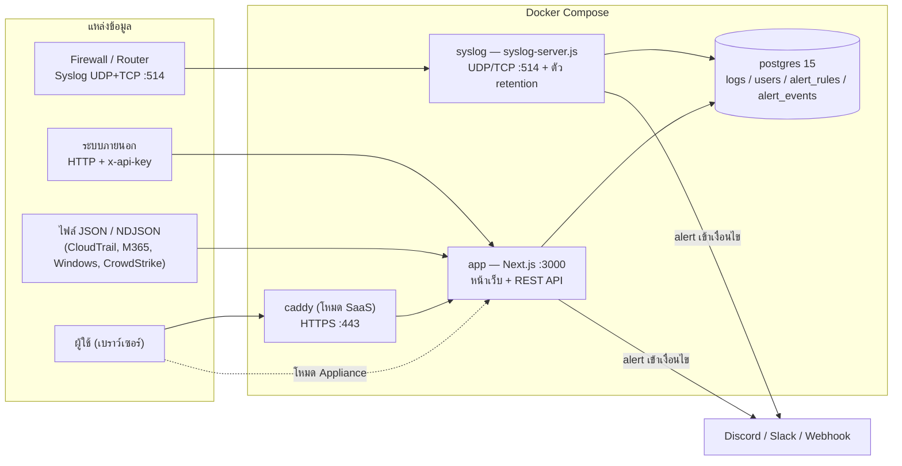

# สถาปัตยกรรมระบบ

## ภาพรวม

| Service | หน้าที่ | พอร์ตที่เปิดออกภายนอก |
|---------|---------|-------------------------|
| `postgres` | เก็บข้อมูลทั้งหมด | ไม่เปิด (เข้าถึงได้เฉพาะ container ในเครือข่ายเดียวกัน) |
| `app` | หน้าเว็บ, REST API, ตรวจ alert | 3000 (โหมด SaaS ผูกที่ 127.0.0.1) |
| `syslog` | รับ Syslog UDP/TCP, ลบ log เก่า | 514/udp, 514/tcp |
| `caddy` | HTTPS reverse proxy (เฉพาะ profile `saas`) | 80, 443 |

`app` และ `syslog` ใช้ image เดียวกัน (`logmgmt-app`) ต่างกันที่คำสั่งเริ่มต้น จึง build ครั้งเดียว และใช้โค้ดใน `lib/` ร่วมกัน

## เส้นทางของข้อมูล (Data flow)

1. **รับเข้า** — Syslog เข้า `syslog-server.js`; HTTP/ไฟล์เข้า `app/api/ingest*`
2. **ยืนยันตัวตน** — HTTP ใช้ `x-api-key` (หรือ cookie session); Syslog ไม่มี key จึงกำหนด tenant จาก `tenant=` ในข้อความ → ตารางจับคู่ IP (`SYSLOG_TENANT_MAP`) → ค่าเริ่มต้น (`SYSLOG_DEFAULT_TENANT`) ตามลำดับ
3. **Normalize** — `lib/normalize.js` แปลงทุกรูปแบบเป็น Schema กลาง (ตารางด้านล่าง) ตรวจความถูกต้อง ตัดความยาวให้พอดีคอลัมน์ และเก็บฟิลด์ที่ไม่อยู่ใน schema ไว้ใน `data` (JSONB)
4. **บันทึก** — `lib/ingest.js` เขียนลง Postgres ใน transaction เดียว (แบ่ง chunk ละ 500 แถว) ข้อมูลที่ผิดรูปแบบแม้เพียงรายการเดียวทำให้ทั้ง batch ถูกปฏิเสธ (`400` พร้อมระบุลำดับรายการที่ผิด) ไม่มีข้อมูลค้างครึ่งๆ กลางๆ
5. **ตรวจ alert** — หลังบันทึกสำเร็จ เรียก `scheduleAlertCheck` (debounce 2 วินาที) เพื่อประเมินกฎทั้งหมด
6. **ค้นหา** — `lib/queries.js` สร้างเงื่อนไขแบบ parameterized ทุกครั้ง โดย tenant มาจาก session/API key เท่านั้น

## Schema กลาง (ตาราง `logs`)

| กลุ่ม | คอลัมน์ |
|-------|---------|
| เวลา | `timestamp` (เวลาของเหตุการณ์), `ingested_at` (เวลาที่ระบบรับ) |
| การจัดกลุ่ม | `tenant`, `source` (`firewall`, `network`, `api`, `aws`, `m365`, `ad`, `crowdstrike`, …), `vendor`, `product` |
| เหตุการณ์ | `event_type`, `event_subtype`, `severity` (0–10), `action` |
| เครือข่าย | `src_ip`, `src_port`, `dst_ip`, `dst_port`, `protocol` |
| ตัวตน/ทรัพยากร | `user_name`, `host`, `process`, `url`, `http_method`, `status_code` |
| กฎที่ตรวจพบ | `rule_name`, `rule_id` |
| คลาวด์ | `cloud_account_id`, `cloud_region`, `cloud_service` |
| อื่นๆ | `tags` (เช่น `internal_ip`/`external_ip`), `raw` (ข้อความดิบ), `data` (ต้นฉบับ JSON) |

ตารางอื่น: `users` (รหัสผ่านแบบ scrypt hash, role `admin`/`viewer`, tenant), `alert_rules` (กฎ), `alert_events` (ผลที่เกิดขึ้น)

ดัชนี: `(tenant, timestamp)`, `ingested_at`, `(tenant, source, ingested_at)`, `src_ip` และ trigram GIN บน `raw` เพื่อให้ค้นข้อความแบบ `ILIKE '%...%'` เร็ว

## การแยก tenant และสิทธิ์ (RBAC)

| ผู้เรียก | tenant ที่ใช้ | ทำได้ |
|----------|----------------|-------|
| API key ของ `demoA` | `demoA` เสมอ (ค่า `tenant` ในข้อมูลถูกเขียนทับ) | ส่ง/ค้นหา log ของ `demoA` |
| API key `*` | ตามที่ระบุ | ส่ง/ค้นหาทุก tenant |
| `viewer` (เช่น `viewerA`) | tenant ใน JWT | ดู log/alert ของ tenant ตนเท่านั้น ค่า `?tenant=` ถูกละเลย |
| `admin` | `all` | ดูทุก tenant, สร้าง/เปิดปิด/ลบกฎ alert |

หลักการ: **ไม่เชื่อ tenant ที่ client ส่งมา** ทุกคำสั่ง SQL ที่อ่านข้อมูลผูก tenant จากข้อมูลที่เซิร์ฟเวอร์ตรวจสอบแล้ว (`lib/session.js: scopeTenant`, `lib/ingest-auth.js`) และมี test ยืนยันว่า key/ผู้ใช้ของ tenant หนึ่งมองไม่เห็นข้อมูลของอีก tenant

## Alert

- กฎเก็บในตาราง `alert_rules`: รูปแบบ `event_type` (ILIKE) หรือ severity ขั้นต่ำ, จำนวนครั้ง (threshold), ช่วงเวลา (window), จัดกลุ่มตาม `src_ip`/`user_name`/`host`, tenant (ว่าง = ทุก tenant ตรวจแยกทีละ tenant)
- กฎเริ่มต้น 2 ข้อ: ล็อกอินล้มเหลวตั้งแต่ 3 ครั้งใน 5 นาทีจาก IP เดียวกัน; เหตุการณ์ severity ≥ 8 (จัดกลุ่มตาม host)
- **ป้องกัน alert ซ้ำ**: กลุ่มเดียวกัน (กฎ + tenant + group key) จะไม่เกิดซ้ำภายในช่วง cooldown = max(60 วินาที, window) โดยใช้ `INSERT … WHERE NOT EXISTS` และ advisory lock กันสองโปรเซส (`app` และ `syslog`) ตรวจพร้อมกัน
- ส่ง webhook **หลัง commit** และเฉพาะเมื่อเกิด alert ใหม่จริง (Discord `{content}`, Slack `{text}`, ทั่วไป `{text, content, alert}`; timeout 5 วินาที; ล้มเหลวไม่ทำให้การรับ log ล้ม)
- ใช้ `ingested_at` ในการนับ เพื่อให้ไฟล์ log เก่าที่เพิ่งอัปโหลดไม่ก่อ alert ผิดช่วง

## Retention

`lib/retention.js` ลบ `logs` และ `alert_events` ที่ `ingested_at` เก่ากว่า `RETENTION_DAYS` (ค่าเริ่มต้น 7) ทำงานเมื่อ service `syslog` เริ่มและทุก 6 ชั่วโมง ใช้ `ingested_at` เพราะ log ที่มี timestamp เก่าแต่เพิ่งรับเข้ามาไม่ควรถูกลบทิ้งทันที

## ความปลอดภัย

| ประเด็น | วิธีที่ใช้ |
|---------|-----------|
| การเข้ารหัสขณะส่ง | Caddy ทำ HTTPS (Let's Encrypt สำหรับโดเมนจริง หรือ self-signed สำหรับ IP); cookie ตั้ง `secure` เมื่อเข้าผ่าน HTTPS |
| ความลับ | ไม่มีในโค้ด — สร้างสุ่มลง `.env` โดย `scripts/setup-env.*`; แอปปฏิเสธ `JWT_SECRET` ที่สั้น/ยังเป็น `CHANGE_ME`; API key ที่ยังเป็น `CHANGE_ME` ถูกละเลย |
| รหัสผ่าน | scrypt + salt สุ่ม; ตรวจแบบ constant-time; login มี dummy hash กัน timing และจำกัด 5 ครั้ง/15 นาที |
| API key | เทียบด้วย SHA-256 digest แบบ constant-time |
| Session | JWT (HS256) อายุ 1 วันใน cookie `httpOnly`, `sameSite=lax` |
| SQL injection | ทุกค่าจากผู้ใช้เป็น parameter; อักขระ `%` `_` ในคำค้นถูก escape; ชื่อคอลัมน์ที่ใช้ group-by เป็น allowlist |
| ฐานข้อมูล | ไม่เปิดพอร์ต 5432 ออกภายนอก |
| ขนาดข้อมูล | batch ≤ 5,000 รายการ, ไฟล์ ≤ 10 MB |

## เหตุผลการเลือกเทคโนโลยี

| เลือก | เหตุผล |
|-------|--------|
| **Next.js (App Router)** | หน้าเว็บ (server component) และ REST API อยู่ในโปรเจกต์เดียว deploy ง่ายด้วย container เดียว |
| **PostgreSQL** | ปริมาณข้อมูลระดับเดโม/องค์กรเล็กเพียงพอ ค้นหา/รวมกลุ่มด้วย SQL ได้ตรงไปตรงมา, `pg_trgm` ช่วยค้นข้อความ, JSONB เก็บฟิลด์ที่ไม่อยู่ใน schema ได้โดยไม่ต้องแก้ตาราง (ถ้าข้อมูลโตมากควรพิจารณา ClickHouse/OpenSearch) |
| **Syslog เป็น service แยก** | พอร์ต 514 และวงจรชีวิตต่างจากเว็บ ล่มหรือ restart ได้โดยไม่กระทบกัน |
| **Caddy** | ขอและต่ออายุใบรับรองอัตโนมัติ ตั้งค่าไม่กี่บรรทัด |
| **Docker Compose** | ตรงกับโจทย์ทั้งโหมด Appliance และ SaaS (profile `saas`) |
| **สร้าง JWT/รหัสผ่านเอง (jose + scrypt)** | ใช้ไลบรารีมาตรฐาน ไม่ต้องเพิ่ม dependency ใหม่ |

## ข้อจำกัดและแนวทางขยาย

- ตรวจ alert ด้วยการ query ตามกฎหลังรับข้อมูล เหมาะกับข้อมูลระดับเดโม; หากปริมาณสูงควรแยกเป็น worker/streaming
- ยังไม่มี TLS สำหรับ Syslog, ไม่มีหน้าจัดการผู้ใช้, ยังไม่มี rate limit ที่ `/api/ingest` (พึ่งการจำกัดที่ระดับเครือข่าย/Caddy)
- Postgres เป็น single node ไม่มี replication; การสำรองข้อมูลทำโดย `pg_dump` จากภายนอก
